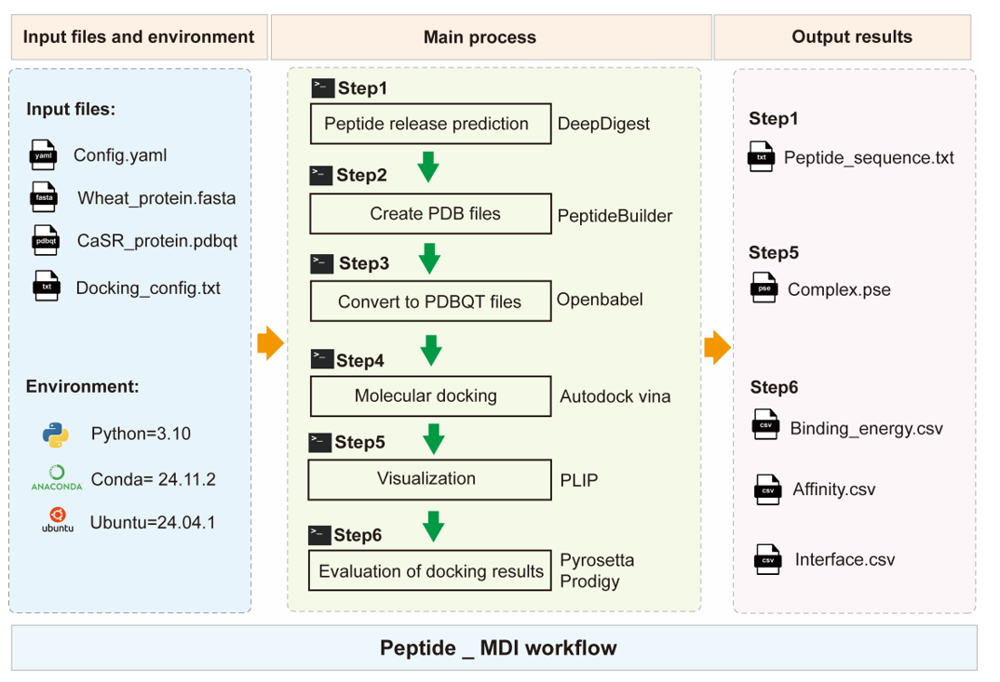

# peptide_MDI

### Authors
- Tianfei YU  
- Tianshuo HU  
- Yan LIU  
- Qian LIN  

---

## Introduction
**peptide_MDI** is a workflow designed for the prediction and screening of bioactive peptides from proteins. This streamlined process integrates computational tools to analyze protein sequences and identify potential peptides with biological activity.

---

## Workflow
### Overview
Below is an overview of the workflow:



### Step 1: Configure the Environment
Before running the workflow, ensure you have **Anaconda** installed on your system.

1. Create a new Conda environment:
   ```bash
   conda create -n peptide_MDI

2. Activate the environment：
   ```bash
   conda activate peptide_MDI
   
3. Install Nextflow：
   ```bash
   conda install -c bioconda nextflow

### Step 2: Navigate to the Working Directory
Switch to the directory containing the workflow scripts and resources:
```bash
   cd /path/to/peptide_MDI
```

### Step 3: Upload the Required Files into the `in_put` Folder
Ensure the following files are placed in the `in_put` folder before running the workflow:

- **Protein sequence file**:  
  `Protein.fasta`  
  Contains the protein sequences to be analyzed.

- **Receptor structure file**:  
  `Receptor.pdbqt`  
  The 3D structure of the receptor used for docking studies.

- **Docking configuration file**:  
  `Docking_config.txt`  
  Provides information about the active pocket of the receptor.


---

### Step 4: Run the Workflow
Execute the workflow using Nextflow by running the following command:
```bash
nextflow run main.nf -with-conda
```

### Configuration
If you need to modify the type of simulated enzyme or the peptide release settings, please edit the `config.yaml` file:

- **`protease`**: Set the type of protease used for simulation.  
- **`min_len`** and **`max_len`**: Adjust the minimum and maximum length of the released peptide fragments.

Example configuration in `config.yaml`:
```yaml
protease: trypsin
min_len: 2
max_len: 10
```

## Contact
For any questions or issues, please contact:
- **Email**: tianfeiyu0721@163.com

---

## Citation
If you use this workflow in your research, please cite the following paper:

**Yu, D., Li, H., Liu, Y., Yang, X., Yang, W., Fu, Y., Zuo, Y.-a., & Huang, X. (2024).**  
*Application of the molecular dynamics simulation GROMACS in food science.*  
FOOD RESEARCH INTERNATIONAL, 190, 114653.  
[https://doi.org/10.1016/j.foodres.2024.114653](https://doi.org/10.1016/j.foodres.2024.114653)

---

## References
The following references were utilized in the development and implementation of this workflow:

1. Adasme, M. F., Linnemann, K. L., Bolz, S. N., Kaiser, F., Salentin, S., Haupt, V. J., & Schroeder, M. (2021).  
   *PLIP 2021: Expanding the scope of the protein–ligand interaction profiler to DNA and RNA.*  
   Nucleic Acids Research, 49(W1), W530-W534.  
   [https://doi.org/10.1093/nar/gkab294](https://doi.org/10.1093/nar/gkab294)

2. Di Tommaso, P., Chatzou, M., Floden, E. W., Barja, P. P., Palumbo, E., & Notredame, C. (2017).  
   *Nextflow enables reproducible computational workflows.*  
   Nature Biotechnology, 35(4), 316-319.  
   [https://doi.org/10.1038/nbt.3820](https://doi.org/10.1038/nbt.3820)

3. Eberhardt, J., Santos-Martins, D., Tillack, A. F., & Forli, S. (2021).  
   *AutoDock Vina 1.2.0: New Docking Methods, Expanded Force Field, and Python Bindings.*  
   Journal of Chemical Information and Modeling, 61(8), 3891-3898.  
   [https://doi.org/10.1021/acs.jcim.1c00203](https://doi.org/10.1021/acs.jcim.1c00203)

4. Guntuboina, C., Das, A., Mollaei, P., Kim, S., & Barati Farimani, A. (2023).  
   *PeptideBERT: A Language Model Based on Transformers for Peptide Property Prediction.*  
   The Journal of Physical Chemistry Letters, 14(46), 10427-10434.  
   [https://doi.org/10.1021/acs.jpclett.3c02398](https://doi.org/10.1021/acs.jpclett.3c02398)

5. Jo, S., Kim, T., Iyer, V. G., & Im, W. (2008).  
   *CHARMM-GUI: A web-based graphical user interface for CHARMM.*  
   Journal of Computational Chemistry, 29(11), 1859-1865.  
   [https://doi.org/10.1002/jcc.20945](https://doi.org/10.1002/jcc.20945)

6. Tien, M. Z., Sydykova, D. K., Meyer, A. G., & Wilke, C. O. (2013).  
   *PeptideBuilder: A simple Python library to generate model peptides.*  
   PeerJ, 1, e80.  
   [https://doi.org/10.7717/peerj.80](https://doi.org/10.7717/peerj.80)

7. Yang, J., Gao, Z., Ren, X., Sheng, J., Xu, P., Chang, C., & Fu, Y. (2021).  
   *DeepDigest: Prediction of Protein Proteolytic Digestion with Deep Learning.*  
   Analytical Chemistry, 93(15), 6094-6103.  
   [https://doi.org/10.1021/acs.analchem.0c04704](https://doi.org/10.1021/acs.analchem.0c04704)


